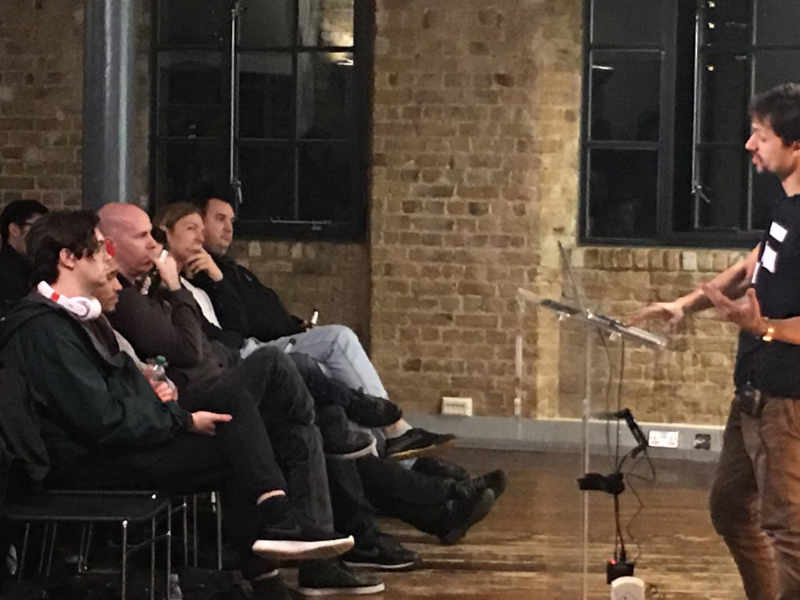

  

With the help of [Electron](https://electron.atom.io/), it is now possible to run your entire web stack (SPA + backend) in a single process. When applied to testing, this becomes a compelling alternative to webdriver based testing, as it is much faster and easier to debug.

In this talk, Artem sets the scene by defining some base terminology of what types of tests there are in a typical web app, what they're for and then demonstrates a [real example](https://github.com/featurist/full-stack-js-testing-demo).
