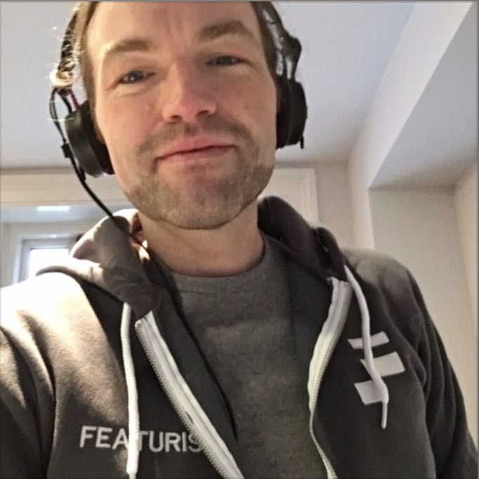

  

Practice working in the "test && commit || revert" workflow. If the tests fail, then the code goes back to the state where the tests last passed. Work through some examples, feel first-hand how TCR is different from TDD and how to integrate it into your development tools and workflow.

Josh will lead us in an exercise exploring the benefits of this approach. Bring a laptop and code along. Refreshments provided.

<strong>Join us at Unit 220 Metal Box Factory, 30 Great Guildford St, London SE1 0HS from 6pm on Wed 6th Feb 2019</strong>.

Please DM us @<a href="https://twitter.com/featurists">featurists</a> if you'd like to attend.

"test && commit || revert" is a new programming workflow [introduced recently by Kent Beck](https://medium.com/@kentbeck_7670/test-commit-revert-870bbd756864).
